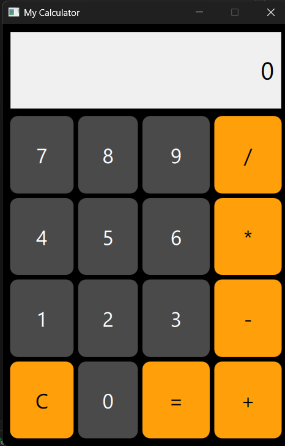

# MyCalculator

A simple calculator built with **Qt** and **C++**.

## Motivation
This is my first GUI application using QT. The primary goal was to learn the fundamentals of the Qt Framework and UI design.

## Features
- Basic arithmetic operations: Addition, Subtraction, Multiplication, Division.
- Clean user interface.

